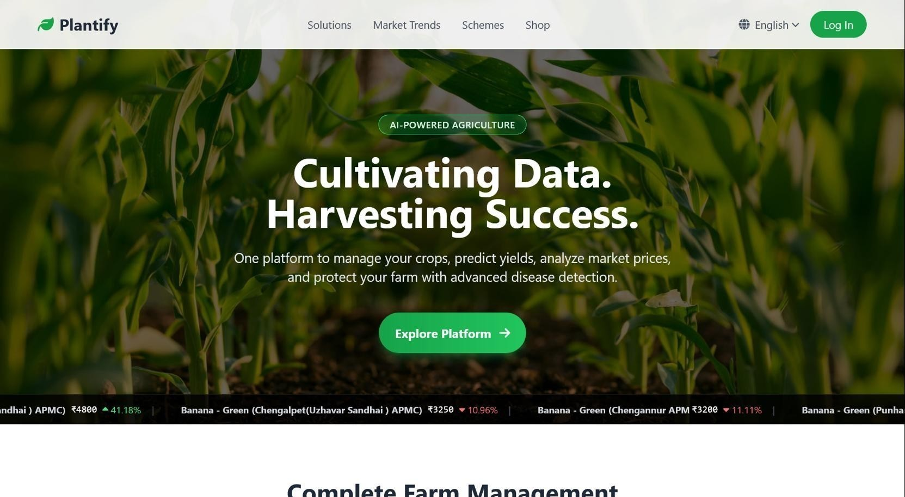
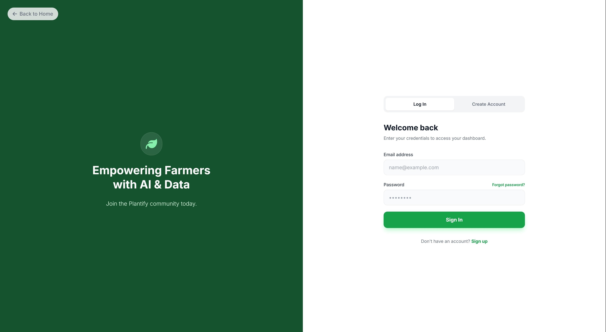
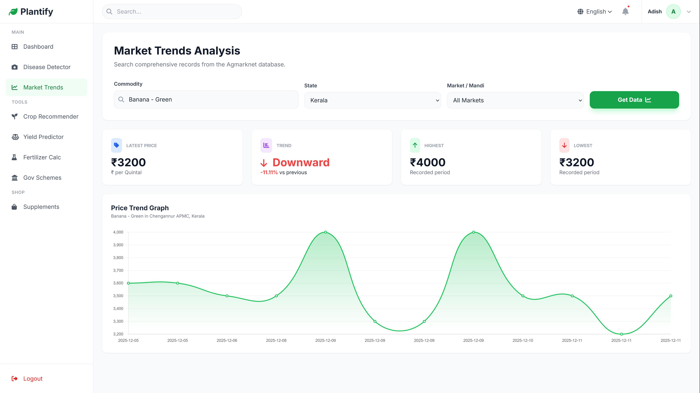
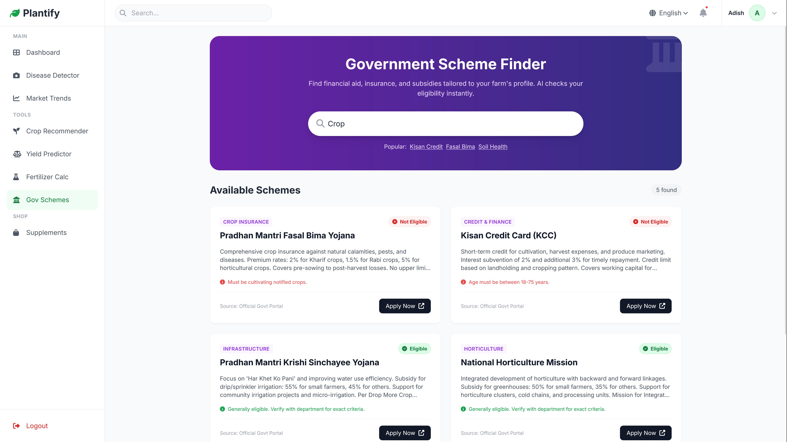

# Plantify: Cultivating Data. Harvesting Success.


[](LICENSE)

## 🌟 Project Overview

Plantify is designed to bridge the digital divide in agriculture by empowering farmers with advanced technology. It provides a single platform that helps optimize farm productivity, make informed decisions, strategize against potential risks through 'What-If' simulations, anticipate market trends, and stay aligned with government programs, all while safeguarding crop health. Its simple, responsive, and multilingual interface ensures that cutting-edge agricultural insights are accessible to every farmer.

## ✨ Core Features & Functionality

The Plantify platform is a comprehensive suite of tools designed to cover every critical aspect of modern agriculture, from farm diagnostics to market intelligence.

### 1. AI-Powered Diagnostics & Farm Health

| Feature                        | Description                                                                                                                                                                 |
| :----------------------------- | :-------------------------------------------------------------------------------------------------------------------------------------------------------------------------- |
| **Disease Classification**     | Instantaneous analysis of plant photos to classify diseases, providing a crucial first step toward rapid intervention.                                                      |
| **Fertilizer Recommendation**  | An intelligent calculator that suggests optimal nutrient and supplement dosages tailored to each crop and soil condition.                                                   |
| **Yield Prediction**           | Utilize historical data and current parameters to accurately forecast potential harvest yields, optimizing planning and sales.                                              |
| **Crop Recommendation**        | Intelligent analysis that recommends the most suitable crop to plant based on soil nutrient levels, pH, temperature, humidity, and rainfall.                                |
| **Pesticide & Warning System** | Receive timely alerts and specific recommendations for pesticide use or other protective measures based on detected diseases or environmental factors.                      |
| **What-If Scenario Simulator** | Assess farm resilience by simulating critical scenarios such as extreme weather or market shifts to generate actionable, AI-driven survival strategies for risk mitigation. |

### 2. Market Intelligence & Financial Planning

| Feature                         | Description                                                                                                                                           |
| :------------------------------ | :---------------------------------------------------------------------------------------------------------------------------------------------------- |
| **Market Trend Analysis**       | Real-time tracking and deep-dive analytics on commodity prices from various Mandis (wholesale markets), helping farmers decide the best time to sell. |
| **Govt. Scheme Recommendation** | Personalized service that automatically matches the farmer's profile against state and central government subsidy and financial aid schemes.          |
| **Supplement Market**           | An integrated shop/marketplace providing access to purchase recommended fertilizers, pesticides, and growth supplements from verified suppliers.      |

### 3. Personalization & Accessibility

| Feature                      | Description                                                                                                                                                                                         |
| :--------------------------- | :-------------------------------------------------------------------------------------------------------------------------------------------------------------------------------------------------- |
| **Multi-lingual Support**    | Full support for 14+ regional Indian languages (Hindi, Bengali, Telugu, Tamil, etc.) powered by Google Translate, ensuring complete accessibility.                                                  |
| **Personalized Profile**     | Serves as the central data repository for the farmer's land and demographics, automatically driving all personalized recommendations, eligibility checks for schemes, and tailored market insights. |
| **Environmental Monitoring** | Real-time display of critical local environmental data to assist in daily farm decisions.                                                                                                           |

## 4. 📸 Platform Screenshots

Below are some screenshots of the Plantify platform in action.

<p align="center">
  
  
</p>

<p align="center">
  
  
</p>

<p align="center">
  
</p>


## 🛠️ Technical Stack

- **Backend:** Python, Flask, Tensorflow, PyTorch
- **Database:** SQLite3
- **Frontend:** HTML5, TailwindCSS, JavaScript
- **Generative AI / RAG:** Enables intelligent insights and personalized recommendations using Retrieval-Augmented Generation (RAG). It powers the **'What-If' Simulation Engine**, generating detailed survival strategies for complex scenarios like extreme weather or economic crises, alongside real-time advisory alerts.
- **External APIs:**
  - Google Translate (For multi-lingual support)
  - Open-Meteo (For real-time meteorological data: temperature, humidity, wind speed, etc.)
  - OpenStreetMap (For geospatial services and location-based data delivery)

## 🚀 Setup and Installation

To run this project locally, follow these steps:

1.  **Clone the repository:**

    ```bash
    git clone https://github.com/Insane1301/Plantify
    cd Plantify
    ```

2.  **Install dependencies:**
    ```bash
    pip install -r requirements.txt
    ```
3.  **Run the application:**
    ```bash
    python app.py
    ```
    The application will be available at `http://127.0.0.1:5000`.

## 📜 License

This project is licensed under the **MIT License**.

See the [LICENSE](LICENSE) file for details.

## 👅Contributors

- [Mansi](https://github.com/C2HS0H)
- [Yashika](https://github.com/yashikadave2023-wq)

